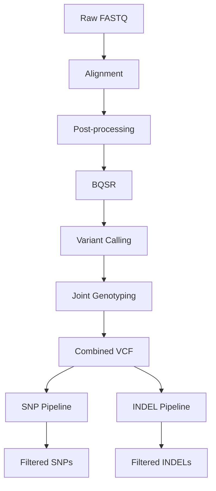

# GATK Variant Calling (SNPs and INDELs)

This repository contains a modular, step-wise workflow for whole genome sequencing (WGS) variant calling using the GATK best practices pipeline.

The workflow is implemented using Bash scripts and performs preprocessing, variant calling, joint genotyping, and variant filtering.  
It was developed using *Arabidopsis thaliana* datasets.

---

## 🧠 Design Philosophy

This pipeline was intentionally implemented as separate scripts without full workflow automation, as it was a learning phase.

This is also useful to:
- Provide transparency into each step of variant calling  
- Allow step-by-step execution and debugging  
- Enable easy modification and testing of individual steps  
- Support learning and exploratory analysis  

---

## 📂 Pipeline Steps

Each step is executed independently using dedicated scripts:

1. Alignment (BWA-MEM2)  
2. Sorting and Duplicate Marking (SAMtools + Picard)  
3. Base Quality Score Recalibration (BQSR)  
4. Variant Calling (HaplotypeCaller in GVCF mode)  
5. Joint Genotyping (GenomicsDB + GenotypeGVCFs)  
6. Variant Selection (SNPs and INDELs)  
7. Variant Filtering  

---

## 🔄 Pipeline Overview



---

## 🚀 Example Usage

```bash
# Step 1: Alignment
bash scripts/bwa-mem2.sh

# Step 2: Post-processing
bash scripts/picardtools.sh

# Step 3: BQSR
bash scripts/bqsr.sh

# Step 4: Variant Calling
bash scripts/haplotypecaller.sh
```

Each script processes multiple samples using looping and requires modification of paths before execution.

---

## 🧬 Key Steps Explained

# Alignment
Reads are aligned to the reference genome using BWA-MEM2.
Read groups are added during alignment for compatibility with GATK.

# BQSR
Systematic sequencing errors are corrected using known variant sites.

# HaplotypeCaller
Variants are called per sample in GVCF mode to enable joint genotyping.

# Joint Genotyping
Multiple GVCFs are combined using GenomicsDB and genotyped together.

# Variant Filtering
Hard filters are applied separately to SNPs and INDELs based on quality metrics.

---

## 🛠 Tools Used
GATK
BWA-MEM2
SAMtools
Picard
📁 Directory Structure
rawdata/              # Input FASTQ files
reference_genome/     # Reference genome files
aligned/              # Intermediate BAM files
results/              # Final outputs and intermediate results
scripts/              # Bash scripts for each step

---

## ⚠️ Limitations
Processes datasets sequentially (no workflow manager)
Requires manual execution of each step
Paths are hardcoded and need modification
Limited parameterization

---

## 🚀 Future Improvements
Convert workflow to Nextflow
Add configuration file
Containerization (Docker/Singularity)
Parallel processing across samples
Additional QC steps

---

## 📌 Notes
Optimized for Arabidopsis thaliana
Can be adapted for other organisms by changing reference and known variant files
Read groups are required for proper GATK processing
